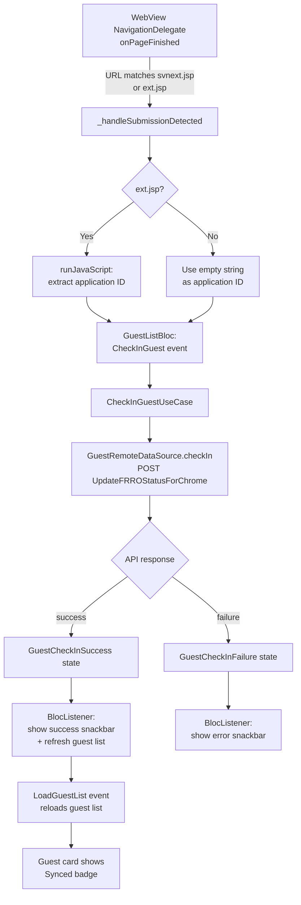
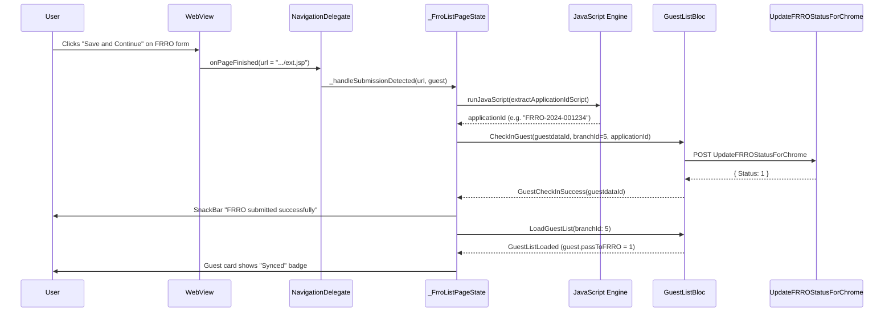
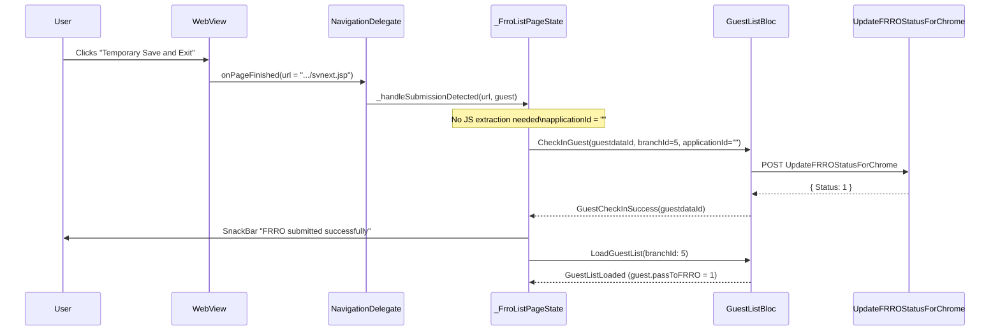
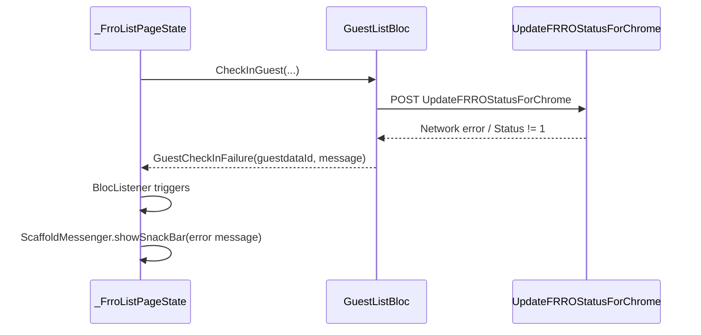

# Design Document: FRRO Submission Tracking

## Overview

When a hotel staff member fills and submits a guest's FRRO Form C via the in-app WebView, the WebView navigates to one of two confirmation URLs. This feature intercepts those URL transitions in the `NavigationDelegate.onPageFinished` callback, extracts the application ID from the resulting page (where available), calls the backend `UpdateFRROStatusForChrome` API to mark the guest as synced, shows a success/failure snackbar, and refreshes the guest list so the guest's card reflects the new "Synced" status.

The feature is entirely contained within the existing FRRO feature slice. It reuses the already-wired `CheckInGuest` BLoC event and `GuestCheckInSuccess`/`GuestCheckInFailure` states, adding only the WebView URL detection logic and the corresponding UI feedback in `_FrroListPageState`.

The two submission outcomes are:
- **Temporary Save and Exit** → WebView navigates to `.../frro/FormC/svnext.jsp`
- **Save and Continue** → WebView navigates to `.../frro/FormC/ext.jsp` (page may contain an application ID in the DOM)

---

## Architecture



---

## Sequence Diagrams

### Happy Path: Save and Continue (ext.jsp with application ID)



### Temporary Save and Exit (svnext.jsp, no application ID)



### Failure Path



---

## Components and Interfaces

### Component 1: `_FrroListPageState` (modified)

**Purpose**: Detects FRRO submission URLs in the WebView and orchestrates the check-in flow.

**New responsibilities**:
- Detect `svnext.jsp` and `ext.jsp` in `onPageFinished`
- Extract application ID via JavaScript injection on `ext.jsp`
- Dispatch `CheckInGuest` event to `GuestListBloc`
- Listen for `GuestCheckInSuccess` / `GuestCheckInFailure` via `BlocListener` and show snackbar
- Dispatch `LoadGuestList` after success to refresh the list

**Key new methods**:

```dart
/// Called when a submission URL is detected. Extracts the application ID
/// (if on ext.jsp) and dispatches CheckInGuest to the bloc.
Future<void> _handleSubmissionDetected(String url, Guest guest);

/// JavaScript snippet injected into ext.jsp to extract the application ID
/// from the page DOM. Returns an empty string if not found.
static const String _extractApplicationIdScript;
```

**Interaction with existing code**:
- Wraps the existing `Scaffold` body in a `BlocListener<GuestListBloc, GuestListState>` to react to `GuestCheckInSuccess` and `GuestCheckInFailure`
- Calls `context.read<GuestListBloc>().add(CheckInGuest(...))` from `_handleSubmissionDetected`
- Calls `context.read<GuestListBloc>().add(LoadGuestList(branchId: 5))` after success

---

### Component 2: `GuestListBloc` (unchanged)

**Purpose**: Already handles `CheckInGuest` event and emits `GuestCheckInSuccess` / `GuestCheckInFailure`. No changes needed.

**Interface** (relevant existing parts):

```dart
// Events consumed
CheckInGuest({
  required int guestdataId,
  required int branchId,
  required String applicationId,
  int userId = 0,
})

// States emitted
GuestCheckInProgress(int guestdataId)
GuestCheckInSuccess(int guestdataId)
GuestCheckInFailure(int guestdataId, String message)
```

---

### Component 3: `GuestRemoteDataSource` (unchanged)

**Purpose**: Already implements `checkIn()` which calls `UpdateFRROStatusForChrome`. No changes needed.

**Interface** (relevant existing parts):

```dart
Future<bool> checkIn({
  required int guestdataId,
  required int branchId,
  required String applicationId,
  int userId = 0,
});
```

---

## Data Models

### Submission Detection Result

This is an in-memory concept (not persisted), used within `_handleSubmissionDetected`:

```dart
enum FrroSubmissionType {
  temporarySave,   // svnext.jsp
  saveAndContinue, // ext.jsp
}

// Derived from URL matching:
// svnext.jsp → FrroSubmissionType.temporarySave
// ext.jsp    → FrroSubmissionType.saveAndContinue
```

### Application ID Extraction

The JavaScript injected into `ext.jsp` attempts to read the application ID from the page. The result is a `String` (empty if not found):

```dart
// Possible DOM locations for the application ID on ext.jsp:
// - Element with id containing "application", "appno", "challan", "frro"
// - Any visible text matching pattern: /[A-Z]{2,4}\/\d{4}\/\d+/ or similar
// - Fallback: empty string ""
```

---

## Algorithmic Pseudocode

### URL Detection and Dispatch Algorithm

```dart
// In NavigationDelegate.onPageFinished, after existing login/form-fill logic:

Future<void> _onPageFinished(String url) async {
  setState(() => _loading = false);
  final lower = url.toLowerCase();

  // --- NEW: Submission detection ---
  if (_isSubmissionUrl(lower)) {
    if (_selectedGuest != null) {
      await _handleSubmissionDetected(url, _selectedGuest!);
    }
    return; // Do not run credential/form-fill scripts on submission pages
  }

  // --- EXISTING: Login / form-fill logic (unchanged) ---
  if (lower.contains('formc') && !lower.contains('formc.jsp') && ...) {
    await _webCtrl.runJavaScript(_credentialsScript);
  } else if (...) {
    ...
  }
}

bool _isSubmissionUrl(String lowerUrl) {
  return lowerUrl.contains('svnext.jsp') || lowerUrl.contains('/ext.jsp');
}
```

**Preconditions:**
- `url` is a non-null, non-empty string provided by the WebView
- `_selectedGuest` may be null (user never selected a guest)

**Postconditions:**
- If `_isSubmissionUrl` returns true and `_selectedGuest != null`, `_handleSubmissionDetected` is called exactly once
- Existing credential/form-fill logic is NOT executed for submission URLs

**Loop Invariants:** N/A (no loops)

---

### Application ID Extraction Algorithm

```dart
static const String _extractApplicationIdScript = """
  (function() {
    // Strategy 1: look for elements whose id/class hints at application number
    var hints = ['applicationno','appno','application_no','challan',
                 'frrochallan','frro_challan','receiptno','receipt_no'];
    for (var i = 0; i < hints.length; i++) {
      var el = document.getElementById(hints[i])
            || document.querySelector('[class*="' + hints[i] + '"]')
            || document.querySelector('[name="' + hints[i] + '"]');
      if (el && el.innerText && el.innerText.trim().length > 0) {
        return el.innerText.trim();
      }
      if (el && el.value && el.value.trim().length > 0) {
        return el.value.trim();
      }
    }
    // Strategy 2: scan all visible text for FRRO application ID pattern
    var pattern = /[A-Z]{2,6}\\/\\d{4}\\/\\d{4,}/;
    var allText = document.body ? document.body.innerText : '';
    var match = allText.match(pattern);
    if (match) return match[0];
    // Fallback
    return '';
  })();
""";

Future<void> _handleSubmissionDetected(String url, Guest guest) async {
  String applicationId = '';

  if (url.toLowerCase().contains('/ext.jsp')) {
    // ext.jsp may contain the application ID in the DOM
    try {
      final result = await _webCtrl.runJavaScriptReturningResult(
        _extractApplicationIdScript,
      );
      applicationId = (result as String?)?.replaceAll('"', '').trim() ?? '';
    } catch (_) {
      applicationId = '';
    }
  }
  // svnext.jsp: applicationId stays ''

  if (!mounted) return;
  context.read<GuestListBloc>().add(
    CheckInGuest(
      guestdataId: guest.guestdataId,
      branchId: 5,
      applicationId: applicationId,
    ),
  );
}
```

**Preconditions:**
- `url` is a non-null string known to match a submission URL
- `guest` is a non-null `Guest` with a valid `guestdataId`
- `_webCtrl` is initialised and the WebView has finished loading the submission page

**Postconditions:**
- `CheckInGuest` event is dispatched to `GuestListBloc` exactly once
- `applicationId` is either a non-empty extracted string or `''`
- No exception propagates out of this method (all JS errors are caught)

**Loop Invariants:** N/A

---

### BlocListener Response Algorithm

```dart
// Wraps the existing Scaffold in a BlocListener:

BlocListener<GuestListBloc, GuestListState>(
  listener: (context, state) {
    if (state is GuestCheckInSuccess) {
      ScaffoldMessenger.of(context).showSnackBar(
        const SnackBar(
          content: Text('FRRO submitted successfully'),
          backgroundColor: Colors.green,
        ),
      );
      // Refresh guest list so the card shows "Synced"
      context.read<GuestListBloc>().add(const LoadGuestList(branchId: 5));
    } else if (state is GuestCheckInFailure) {
      ScaffoldMessenger.of(context).showSnackBar(
        SnackBar(
          content: Text('FRRO submission failed: ${state.message}'),
          backgroundColor: Colors.red,
        ),
      );
    }
  },
  child: /* existing Scaffold */,
)
```

**Preconditions:**
- `BlocListener` is a descendant of the `BlocProvider<GuestListBloc>` already present in `FrroListPage`

**Postconditions:**
- On `GuestCheckInSuccess`: snackbar shown, `LoadGuestList` dispatched
- On `GuestCheckInFailure`: error snackbar shown, no list refresh
- Other states: no action taken

---

## Key Functions with Formal Specifications

### `_isSubmissionUrl(String lowerUrl) → bool`

```dart
bool _isSubmissionUrl(String lowerUrl) {
  return lowerUrl.contains('svnext.jsp') || lowerUrl.contains('/ext.jsp');
}
```

**Preconditions:**
- `lowerUrl` is already lowercased (caller's responsibility)

**Postconditions:**
- Returns `true` iff the URL is one of the two known FRRO submission confirmation pages
- Returns `false` for all other URLs including the main FormC page, login page, and any other FRRO pages

---

### `_handleSubmissionDetected(String url, Guest guest) → Future<void>`

**Preconditions:**
- `_isSubmissionUrl(url.toLowerCase())` is `true`
- `guest.guestdataId > 0`
- Widget is mounted

**Postconditions:**
- Exactly one `CheckInGuest` event is added to `GuestListBloc`
- `applicationId` in the event is either a non-empty string extracted from the page or `''`
- Method completes without throwing

---

### `_extractApplicationIdScript` (JavaScript)

**Preconditions:**
- Executed in the context of `ext.jsp` after page load
- DOM is fully rendered

**Postconditions:**
- Returns a non-null string
- If an application ID element is found: returns its trimmed text/value
- If pattern match succeeds: returns the matched string
- Otherwise: returns `''`

---

## Example Usage

```dart
// In _FrroListPageState.initState(), the NavigationDelegate is updated:

NavigationDelegate(
  onPageStarted: (_) => setState(() => _loading = true),
  onPageFinished: (url) async {
    setState(() => _loading = false);
    final lower = url.toLowerCase();

    // NEW: detect submission and trigger check-in
    if (_isSubmissionUrl(lower)) {
      if (_selectedGuest != null) {
        await _handleSubmissionDetected(url, _selectedGuest!);
      }
      return;
    }

    // EXISTING: login / form-fill (unchanged)
    if (lower.contains('formc') && !lower.contains('formc.jsp') && ...) {
      await _webCtrl.runJavaScript(_credentialsScript);
    } else if (...) {
      ...
    }
  },
)

// The Scaffold is wrapped in a BlocListener:
BlocListener<GuestListBloc, GuestListState>(
  listener: (context, state) {
    if (state is GuestCheckInSuccess) {
      ScaffoldMessenger.of(context).showSnackBar(
        const SnackBar(content: Text('FRRO submitted successfully')),
      );
      context.read<GuestListBloc>().add(const LoadGuestList(branchId: 5));
    } else if (state is GuestCheckInFailure) {
      ScaffoldMessenger.of(context).showSnackBar(
        SnackBar(content: Text('FRRO submission failed: ${state.message}')),
      );
    }
  },
  child: Scaffold(...),
)
```

---

## Correctness Properties

1. **Idempotency guard**: If `_selectedGuest` is `null` when a submission URL is detected, no `CheckInGuest` event is dispatched and no snackbar is shown.

2. **No double-dispatch**: The `return` statement after `_handleSubmissionDetected` ensures the existing credential/form-fill scripts are never run on submission pages, preventing unintended side effects.

3. **JS error isolation**: All `runJavaScriptReturningResult` calls are wrapped in try/catch; a JS failure degrades gracefully to `applicationId = ''` rather than crashing the flow.

4. **State restoration**: `GuestListBloc._onCheckInGuest` already restores the previous `GuestListLoaded` state after emitting `GuestCheckInSuccess`/`GuestCheckInFailure`, so the guest list remains visible.

5. **Mounted check**: `_handleSubmissionDetected` checks `mounted` before dispatching to the bloc, preventing setState-after-dispose errors.

6. **URL specificity**: `/ext.jsp` is matched with a leading slash to avoid false positives from URLs that merely contain the substring `ext.jsp` in a query parameter or path segment.

---

## Error Handling

### Scenario 1: `_selectedGuest` is null at submission time

**Condition**: User navigates to a submission URL without having selected a guest (e.g., manually navigated or session expired).  
**Response**: `_handleSubmissionDetected` is not called; the page loads normally.  
**Recovery**: No action needed; the user can select a guest and re-submit.

---

### Scenario 2: JavaScript extraction fails on `ext.jsp`

**Condition**: The DOM structure of `ext.jsp` changes, or the script throws an error.  
**Response**: `applicationId` defaults to `''`; `CheckInGuest` is still dispatched.  
**Recovery**: The backend API accepts an empty `guest_FrroChellan`; the guest is still marked as synced.

---

### Scenario 3: `UpdateFRROStatusForChrome` API returns failure

**Condition**: Network error, server error, or `Status != 1`.  
**Response**: `GuestCheckInFailure` state is emitted; error snackbar is shown.  
**Recovery**: The guest list is NOT refreshed; the guest remains unsynced. The user can retry by re-submitting the form.

---

### Scenario 4: Widget unmounted before async operations complete

**Condition**: User navigates away from `FrroListPage` while `_handleSubmissionDetected` is awaiting JS result.  
**Response**: The `if (!mounted) return` guard prevents the bloc dispatch.  
**Recovery**: No crash; the submission is silently dropped. The user would need to re-open the FRRO page.

---

## Testing Strategy

### Unit Testing Approach

- Test `_isSubmissionUrl` with a table of URLs: `svnext.jsp`, `/ext.jsp`, `formc.jsp`, `formc`, `newcform`, empty string, unrelated URLs.
- Test `GuestListBloc._onCheckInGuest` with mock `CheckInGuestUseCase` returning success and failure.
- Test that `GuestCheckInSuccess` triggers `LoadGuestList` dispatch (via BlocListener logic extracted to a testable method).

### Widget Testing Approach

- Mock `GuestListBloc` and `WebViewController`.
- Simulate `GuestCheckInSuccess` state → assert snackbar with "FRRO submitted successfully" appears.
- Simulate `GuestCheckInFailure` state → assert error snackbar appears.
- Simulate `GuestCheckInSuccess` state → assert `LoadGuestList` event is added to the bloc.

### Integration Testing Approach

- Not applicable for WebView-dependent flows in automated tests; manual QA on device is required for the full WebView → URL detection → API call flow.

---

## Performance Considerations

- JavaScript injection via `runJavaScriptReturningResult` is asynchronous and non-blocking; the UI remains responsive during extraction.
- The `LoadGuestList` refresh after success triggers a single API call; no polling or repeated requests.
- The `_isSubmissionUrl` check is a simple string contains operation — O(n) on URL length, negligible cost.

---

## Security Considerations

- The JavaScript extraction script only reads from the DOM; it does not write or exfiltrate data.
- The `applicationId` value is passed directly to the backend API. Since it originates from the FRRO government website's own DOM, it is trusted input, but the backend should still validate it.
- The `Authorization: Bearer <token>` header is already applied by `GuestRemoteDataSourceImpl.checkIn()`.

---

## Dependencies

- `webview_flutter` — already in use; `runJavaScriptReturningResult` is available in v4+.
- `flutter_bloc` — already in use; `BlocListener` and `context.read` are available.
- `GuestListBloc`, `CheckInGuest`, `GuestCheckInSuccess`, `GuestCheckInFailure` — all already implemented, no changes needed.
- `GuestRemoteDataSource.checkIn()` — already implemented, no changes needed.
- No new packages required.
